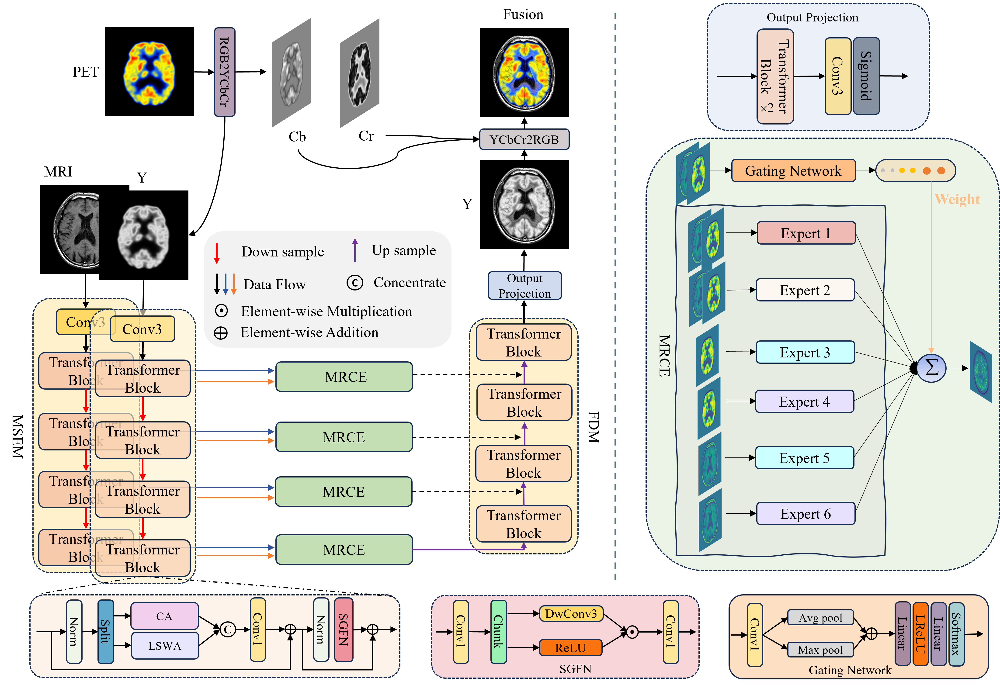

# MRCE-Net
## MRCE-Net: A multi-role collaborative experts deep learning network for multi-modal medical image fusion
The official pytorch implementation of the paper "MRCE-Net: A multi-role collaborative experts deep learning network for multi-modal medical image fusion", [Computerized Medical Imaging and Graphics][paper](https://doi.org/10.1016/j.compmedimag.2026.102737),2026
## 📌 Overview

Multi-modal medical image fusion aimed to combine images from different modalities to leverage their complementary strengths and mitigate the limitations of individual imaging techniques. In recent years, deep learning-based approaches became the dominant direction, surpassing traditional methods in this field. However, existing medical image fusion methods struggle to balance local feature extraction with global context representation, and to effectively capture the specificity and complementarity of different modalities. To overcome these limitations, we propose a Multi-Role Collaborative Experts Network, termed MRCE-Net, for multi-modal medical image fusion. Specifically, we employed a dual-branch encoder to extract modality-specific features from each modality. This encoder integrated a window-based Transformer for local feature extraction and a global channel-based Transformer for capturing long-range contextual dependencies, effectively balancing both aspects. In addition, we propose a Multi-Role Collaborative Experts fusion module that enables specialized experts to jointly model distinct aspects of multi-modal features, with a particular focus on capturing both modality-specific characteristics and inter-modality complementarity. By exploiting the synergistic capabilities of the experts, our framework achieved more comprehensive feature representation and more accurate fusion results. Extensive experiments on a public multi-modal medical image fusion benchmark and an in-house collected brain anatomical and functional imaging dataset demonstrate that our method outperforms state-of-the-art approaches in both visual quality and quantitative performance.
- By integrating sliding window self-attention into cross-channel attention and coupling it with modality-specific encoders, the proposed design enhances the representational capacity of multi-modal medical images.
- We propose a Multi-Role Collaborative Experts module to effectively fuse complementary features across modalities while preserving modality-specific information.
- We evaluated our method against 11 state-of-the-art multi-modal fusion approaches on public and private medical datasets, and results across six metrics demonstrate its effectiveness and superiority.
## 🧠 Network Architecture
The overall framework of MRCE-Net is illustrated below.



## ⚙️ Installation

### 1. Clone the repository
git clone https://github.com/Dpw506/MRCENet.git 

cd MRCENet

### 2. Create environment
conda create -n mrcenet python=3.12.7

conda activate mrcenet

### 3. Install dependencies
pip install -r requirements.txt

## 📂 Dataset
We evaluate our method on several multi-modal medical image datasets and in-house datasets:

- Harvard PET-MRI dataset
- Harvard MRI-SPECT dataset
- Harvard MRI-CT dataset
- WHU-MRI-PET dataset

Organize the dataset as follows:
```
dataset/
 ├── train
 │    ├── modality1
 │    └── modality2
 └── test
      ├── modality1
      └── modality2
```

## 🚀 Training
To train the MRCE-Net model:
```python
python train_MRCE.py
```
## 🔍 Testing
To evaluate the trained model:
```python
python test.py
```

## 📊 Results


## 📄 Citation
If you use this code or models in your research and find it helpful, please cite the following paper:
```
@article{DONG2026102737,
title = {MRCE-Net: A multi-role collaborative experts deep learning network for multi-modal medical image fusion},
journal = {Computerized Medical Imaging and Graphics},
pages = {102737},
year = {2026},
issn = {0895-6111},
doi = {https://doi.org/10.1016/j.compmedimag.2026.102737},
url = {https://www.sciencedirect.com/science/article/pii/S0895611126000406},
author = {Pengwei Dong and Bo Su and Zhouxian Lu and Xiangyun Hu and Lihong Bu and Chao Wang and Haofeng Xie and Zhuang Cai and Pengfei Wang and Bo Wang and Wei Zhang and Shuangshi Jiang and Tao Ke},
keywords = {Multi-modal medical image fusion, Collaborative, Transformer, Mixture-of-experts},
abstract = {Multi-modal medical image fusion aimed to combine images from different modalities to leverage their complementary strengths and mitigate the limitations of individual imaging techniques. In recent years, deep learning-based approaches became the dominant direction, surpassing traditional methods in this field. However, existing medical image fusion methods struggle to balance local feature extraction with global context representation, and to effectively capture the specificity and complementarity of different modalities. To overcome these limitations, we propose a Multi-Role Collaborative Experts Network, termed MRCE-Net, for multi-modal medical image fusion. Specifically, we employed a dual-branch encoder to extract modality-specific features from each modality. This encoder integrated a window-based Transformer for local feature extraction and a global channel-based Transformer for capturing long-range contextual dependencies, effectively balancing both aspects. In addition, we propose a Multi-Role Collaborative Experts fusion module that enables specialized experts to jointly model distinct aspects of multi-modal features, with a particular focus on capturing both modality-specific characteristics and inter-modality complementarity. By exploiting the synergistic capabilities of the experts, our framework achieved more comprehensive feature representation and more accurate fusion results. Extensive experiments on a public multi-modal medical image fusion benchmark and an in-house collected brain anatomical and functional imaging dataset demonstrate that our method outperforms state-of-the-art approaches in both visual quality and quantitative performance. The source code will be made publicly available upon publication at https://github.com/Dpw506/MRCENet.}
}
```

## 📧 Contact
If you encounter any problems with the code, want to report bugs, etc.
Please contact me at dongpw@whu.edu.cn.

## ⭐ Acknowledgements
